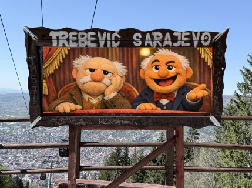

# Thorsten Butz & Rolf McLaughlin

Thorsten Butz and Rolf McLaughlin have both been involved in the MCT programme for more than 50 years in total. **[What constitues a course?](what-constitutes-a-course/what-constitutes-a-course-mctsummit2026.pdf)** highlights their perspective on the past and present state of the programme.

Thorsten Butz: [Website](https://thorsten-butz.de), speaker profile on [run.events](https://speakers.run.events/thorstenbutz) and on [sessionize.com](https://sessionize.com/thorstenbutz/)

Rof McLaughlin: [Website](https://thecloud42.com), speaker profile on [sessionize.com](https://sessionize.com/Rolf/#:~:text=He%20is%20a%20former%20PowerShell,and%20Implementation%20Guide%20from%20Microsoft.)
