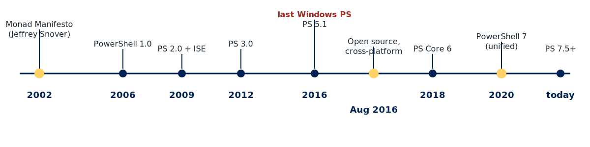

<!-- _class: title -->

# PowerShell 7 for IT Administrators
## Day 1 — Foundations: Shell, Editor, Objects

A 4-day hands-on course

---

## Welcome

- Who you are: IT admins, beginners welcome
- Who I am: your instructor for the next 4 days
- Course style: **lab-driven**, ~55 % hands-on
- Default tools: **PowerShell 7** and **VSCode**
- Legacy context (5.1, ISE): explained, not used day-to-day

---

## What we'll cover in 4 days

| Day | Theme                                  |
|-----|----------------------------------------|
|  1  | Foundations: shell, editor, objects    |
|  2  | Pipeline, providers, CIM/WMI           |
|  3  | Variables, scripting, remoting, jobs   |
|  4  | AD on-prem, EntraID via Graph, capstone |

Labs at the end of every major block. Breaks are sacred.

---

<!-- _class: section -->

# Part 1
## Where did PowerShell come from?

---

<!-- _class: history -->

## The Monad Manifesto (2002)


- Written by **Jeffrey Snover** at Microsoft
- Problem: Windows admins clicked; UNIX admins scripted
- Vision: an object-based automation engine for Windows
- Codename: **Monad** (`msh`) — "monad of all shells"
- .NET under the hood, familiar shell syntax on top

> *"Anything you can do in a GUI you can also type. Because you can type it, you can automate it."* — Jeffrey Snover

---

<!-- _class: history -->

## From Monad to PowerShell

- **2006** — PowerShell 1.0 ships for XP / Server 2003
- **2009** — PowerShell 2.0 + **ISE** (Integrated Scripting Environment)
- **2012–2016** — PS 3.0 → 5.1, the "Windows PowerShell" line
- **Aug 2016** — Microsoft open-sources PowerShell under MIT
- **2018** — PowerShell **Core 6** (cross-platform, .NET Core)
- **2020** — **PowerShell 7** unifies the two lines on .NET 5+

Bruce Payette co-designed the language and wrote the canonical book
*Windows PowerShell in Action*.

---

## A 20-year timeline



Today: **PowerShell 7.5+** on Windows, Linux, and macOS.

---

<!-- _class: section -->

# Part 2
## Two PowerShells, one editor

---

## Windows PowerShell vs PowerShell 7

|                        | Windows PowerShell 5.1 | PowerShell 7             |
|------------------------|------------------------|--------------------------|
| Executable             | `powershell.exe`       | `pwsh.exe` / `pwsh`      |
| Runtime                | .NET Framework 4.x     | .NET 8 / 9               |
| Platforms              | Windows only           | Windows, Linux, macOS    |
| Updates                | security only          | actively developed       |
| Default on Windows     | yes (still shipped)    | side-by-side install     |
| Modern syntax (`?:`, `??`) | no                 | yes                      |

They **coexist**. Neither replaces the other on a Windows box.

---

## Do I still need Windows PowerShell?

Yes — for now, on-prem. Some modules are 5.1-only:

- `WindowsUpdate` (older versions)
- A handful of vendor modules that bind to .NET Framework
- Very old Exchange management tooling

Everything in this course runs in **PowerShell 7**, and we'll flag the
few moments where 5.1 still matters.

---

## The ISE — rest in peace

**Windows PowerShell ISE** shipped with PS 2.0 in 2009. It is:

- Still present on Windows (for 5.1 only)
- **Frozen** — no new features since 2017
- Officially recommended against for new work

Microsoft's successor: **VSCode + PowerShell extension**.

> The ISE cannot run PowerShell 7. If you want PS 7, you need VSCode (or the terminal).

---

## VSCode is the new ISE

Install once, use forever:

- [code.visualstudio.com](https://code.visualstudio.com) — free, cross-platform
- Extension: **PowerShell** (Microsoft, `ms-vscode.powershell`)
- Bonus extensions: **Remote-SSH**, **GitLens**, **Even Better TOML**

Features the ISE never had:
Git integration · multi-cursor · IntelliSense across both PS 5.1 and PS 7 ·
remote editing · rich debugging · themes · extensions

---

## The F8 shortcut — your best friend

In VSCode with the PowerShell extension:

- Select any line(s) in a `.ps1` or `.md` code fence
- Press **F8**
- The selection runs in the **Integrated Console**

Your muscle memory for the next 4 days:

`select → F8 → read output → think → repeat`

---

<!-- _class: section -->

# Part 3
## Anatomy of a command

---

## Verb-Noun: the grammar of PowerShell

Every cmdlet follows the same pattern:

```powershell
Get-Process
Stop-Service
New-ADUser
Invoke-Command
```

- **Verb** — one of ~100 approved verbs (`Get`, `Set`, `New`, `Remove`, …)
- **Noun** — a single thing, always singular
- PascalCase by convention

List them all:

```powershell
Get-Verb | Sort-Object Verb
```

---

## Parameters

```powershell
Get-Process -Name pwsh -IncludeUserName
```

- Always start with `-`
- **Tab completion** expands partial names
- Most parameters are **optional**; mandatory ones will prompt
- `-WhatIf` and `-Confirm` on state-changing cmdlets = safety belt

```powershell
Stop-Service -Name Spooler -WhatIf
```

---

## The discoverability trio

```powershell
Get-Command *-Service          # what commands exist?
Get-Help   Get-Service -Full   # how do I use one?
Get-Service | Get-Member       # what can this object do?
```

If you remember nothing else from Day 1, remember these three.

---

## `Get-Help`: the one you'll use most

```powershell
Update-Help -Force            # one-time, per machine
Get-Help Get-Service          # summary
Get-Help Get-Service -Examples
Get-Help Get-Service -Full
Get-Help Get-Service -Online  # opens learn.microsoft.com
```

> **Gotcha:** help files are not installed by default on fresh systems.
> `Update-Help` needs internet and an elevated shell the first time.

---

<!-- _class: section -->

# Part 4
## The Big Idea — objects, not text

---

## UNIX: text streams

```bash
ps aux | grep firefox | awk '{print $2}' | xargs kill
```

Every `|` hands the next program a **blob of text**. Every tool
has to re-parse. Column positions break when output format changes.

---

## PowerShell: object streams

```powershell
Get-Process firefox | Stop-Process
```

Every `|` hands the next cmdlet a **.NET object** with named
properties. No parsing, no column counting, no breakage.

---

## See the object

```powershell
Get-Process pwsh | Get-Member
```

`Get-Member` shows every property and method on whatever
came down the pipe. It is the **discovery tool** for objects.

Try it on anything:

```powershell
Get-Service  | Get-Member
Get-Date     | Get-Member
Get-ChildItem C:\ | Get-Member
```

---

## Pick the properties you want

```powershell
Get-Process pwsh |
    Select-Object Name, Id, CPU, WorkingSet
```

- One object per row
- You choose the columns
- Output is still objects — pipe onward for more work

---

<!-- _class: gotcha -->

## Gotcha: `Format-*` ends the pipeline

```powershell
Get-Process |
    Format-Table Name, Id |
    Export-Csv processes.csv   # broken — exports format objects, not processes
```

**Rule:** `Format-Table`, `Format-List`, `Format-Wide` produce
display-only objects. They go **last**, right before the screen.

For export, use `Select-Object` instead.

---

## The right way

```powershell
Get-Process |
    Select-Object Name, Id, CPU |
    Export-Csv -Path processes.csv -NoTypeInformation
```

Filter-left, format-right. Always.

---

<!-- _class: section -->

# Part 5
## The `$PROFILE` — your personal setup

---

## What is `$PROFILE`?

A script that runs every time PowerShell starts. Put aliases, functions,
PSReadLine tweaks, and prompt customisations in it.

```powershell
$PROFILE                   # path for THIS host, THIS user
$PROFILE | Format-List * -Force
```

Six possible paths exist. The one above is the common case.

---

## Create and edit your profile

```powershell
if (-not (Test-Path $PROFILE)) {
    New-Item -ItemType File -Path $PROFILE -Force
}
code $PROFILE
```

A useful starter:

```powershell
Set-PSReadLineOption -PredictionSource HistoryAndPlugin
Set-PSReadLineOption -PredictionViewStyle ListView
Set-PSReadLineKeyHandler -Key Tab -Function MenuComplete
```

---

<!-- _class: lab -->

# Lab 1
## Environment setup & orientation

**Goal:** Get PowerShell 7, VSCode, and the PowerShell extension installed,
confirm both 5.1 and 7 coexist, and create your first `$PROFILE`.

**Duration:** ~60 minutes

Open `labs/lab01-environment-setup.md`. F8 your way through it.

---

<!-- _class: lab -->

# Lab 2
## Discovery & the help system

**Goal:** Use `Get-Command`, `Get-Help`, and `Get-Member` to solve
problems without ever leaving the shell.

**Duration:** ~45 minutes

Open `labs/lab02-discovery-help.md`.

---

## Day 1 recap

- PowerShell was born from **Snover's 2002 Monad Manifesto**
- **5.1 and 7 coexist**; ISE is frozen; use **VSCode**
- Everything is **Verb-Noun** with named parameters
- The pipe carries **objects**, not text
- `Get-Command`, `Get-Help`, `Get-Member` — the discoverability trio
- **F8** runs the selected line in the Integrated Console
- `$PROFILE` is your permanent workbench

---

<!-- _class: title -->

# End of Day 1
## Tomorrow: the pipeline in anger
